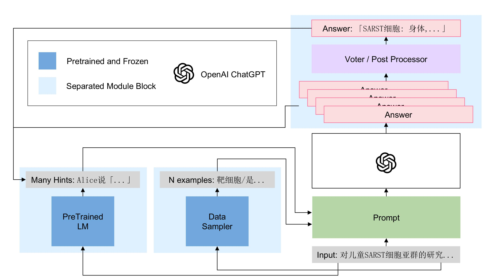
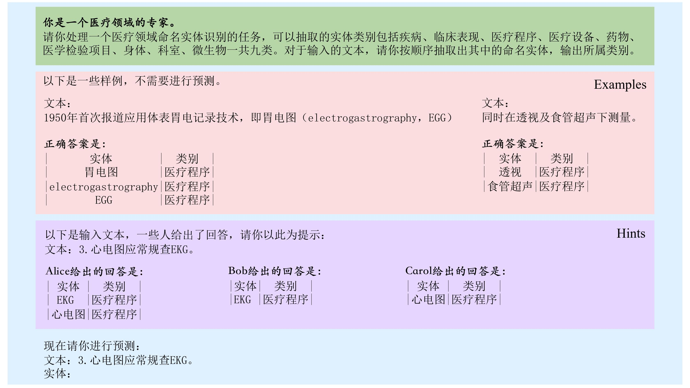

# CMeEE-ChatGPT
Project for AI3612

## Installation

```shell
$ conda create -n cmeee python=3.9
$ conda activate cmeee
$ pip install -r requirements.txt
```

## Framework

- `main.py`: 主程序，用于预测
- `data/`: 数据集
- `src/`: 源代码
  - `src/clusters/`: 用于找到被预测语句最相似的训练集语句，有三种方式：random, bert, linear search (ls)
  - `src/prompts/`: 用于生成ChatGPT的prompt，有两种模式：base 和 hint
  - `src/chat.py`: ChatGPT Completion 核心代码
  - `src/models/`: defination of models，用于提取语句特征
  - `src/utils/`: utils
  - `src/scripts/`: scripts
- `{bert-pretrained-model}/`: BERT 预训练模型，放在最外层，与 release 版保持一致，我们使用的是大作业一中的模型 `../chinese_roberta_large_wwm_ext/`。我们提供了预处理好的句子相似结果在`data_share`中，不影响Usage中的使用；若您复现需要可以与我们联系，或者使用 huggingface 中 `hfl/chinese-roberta-wwm-ext` 替代。

## CMeEE-GPT Architecture and Prompt




## About `./data_share/`

- `*_CMeEE_dev_pred.json`: 大作业一中 dev 集的预测结果，用于 hint 生成
- `{cluster}_{num of shots}_{prompt}_select_dev*.json`: 其中 {cluster} $\in$ {random, bert, ls}，{num of shots} $\in$ [1, 5]，{prompt} $\in$ {base, hint}，为ChatGPT预测结果
  - `bert_5_bert-hint_select_dev_{num}.json`: 我们的最好结果，使用了 5 shots，用 bert_feature 作聚类；使用了 hint prompt，但是 hint 的选取有所不同：
    - `num = N/A or 1`: 2 大作业一中 Bert 预测结果 + `data_share/bert_5_base_select_dev.json` 复用
    - `num = 2`: 2 大作业一中 Bert 预测结果
    - `num = 3`: `data_share/bert_5_base_select_dev.json` 与 `data_share/ls_5_base_select_dev.json`
- `*sim_res.json`: 用于聚类的语句相似度结果，dictionary of list，key 为语句，value 为相似度最高的 8 个训练集语句，使用`src/scripts/calc_bert_sim.py`, `src/scripts/calc_ls_sim.py` 与 `src/scripts/gen_bert_feat.py` 生成。

## Usage and Evaluation

Please make sure that you can ping OpenAI API server!

You need to put the OpenAI API key in `KEY_LIST` in `src/utils/const.py` first.

To generate ChatGPT completion, run:

```shell
$ python main.py -c {cluster} -n {num of shots} -p {prompt} --data select_dev
# E.g.,
$ python main.py -c bert -n 5 -p bert-hint --data select_dev
```

To evaluate ChatGPT completion, run:

```shell
$ python src/scripts/calc_f1_score.py --pred {pred file} --label {label file}
# E.g., (default label file is `data_share/select_dev.json`)

$ python src/scripts/calc_f1_score.py --pred data_share/bert_5_bert-hint_select_dev_1.json
$ python src/scripts/calc_f1_score.py --pred data_share/bert_5_bert-hint_select_dev_2.json
$ python src/scripts/calc_f1_score.py --pred data_share/bert_5_bert-hint_select_dev_3.json

$ python src/scripts/calc_f1_score.py --pred data_share/bert_5_base_select_dev.json
$ python src/scripts/calc_f1_score.py --pred data_share/ls_5_base_select_dev.json
$ python src/scripts/calc_f1_score.py --pred data_share/random_5_base_select_dev.json
```
